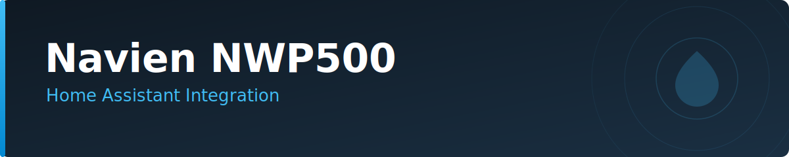

<p align="center">
  
</p>

[](https://github.com/eman/ha_nwp500/releases/latest)
[](https://github.com/eman/ha_nwp500/actions/workflows/ci.yml)
[](#)
[](https://github.com/hacs/integration)
[](https://www.home-assistant.io/)
[](LICENSE)
[](https://github.com/psf/black)

A Home Assistant custom integration for Navien NWP500 Heat Pump Water Heaters. Connects to the Navien cloud API and subscribes to MQTT for real-time updates.

## Table of Contents

- [Features](#features)
- [Installation](#installation)
- [Configuration](#configuration)
- [Usage Guide](#usage-guide)
  - [Operation Modes](#operation-modes)
  - [Sensors & Entities](#sensors--entities)
  - [Reservation Scheduling](#reservation-scheduling)
- [Automation Examples](#automation-examples)
- [Library Version](#library-version)
- [License](#license)

## Features

- **Temperature & mode control** — Set target temperature, switch operation modes, and toggle power.
- **Live status** — Current water temp, power draw, and device state updated via MQTT.
- **Energy tracking** — Cumulative usage and current power consumption from the device.
- **Alerts** — Error codes, leak detection, and freeze/scald warnings via binary sensors.
- **Scheduling** — Recurring mode and temperature changes via the reservation service.

## Installation

### HACS (Recommended)

1. Open HACS in Home Assistant.
2. Go to **Integrations** > **⋮** > **Custom repositories**.
3. Add `https://github.com/eman/ha_nwp500` with category **Integration**.
4. Search for "Navien NWP500" and install.
5. Restart Home Assistant.

### Manual

1. Copy `custom_components/nwp500` to your `config/custom_components/` directory.
2. Restart Home Assistant.

## Configuration

1. Go to **Settings** > **Devices & Services** > **Add Integration**.
2. Search for "Navien NWP500".
3. Enter your **NaviLink** email and password.

## Usage Guide

### Operation Modes

| Mode        | HA Value      | Description                                              |
|-------------|---------------|----------------------------------------------------------|
| Heat Pump   | `heat_pump`   | Heat pump only — most efficient.                         |
| Energy Saver| `eco`         | Hybrid mode balancing efficiency and recovery time.      |
| High Demand | `high_demand` | Heat pump + electric elements — fastest recovery.        |
| Electric    | `electric`    | Electric elements only.                                  |

### Sensors & Entities

Most sensors are **disabled by default**. Enable them from the device page in Home Assistant.

| Category    | Entities                                                       | Enabled by Default |
|-------------|----------------------------------------------------------------|--------------------|
| Control     | Water Heater entity                                            | Yes                |
| Temperature | Tank & DHW temperatures                                        | Yes                |
| Power       | Current power & energy status                                  | Yes                |
| Status      | Error codes & basic status                                     | Yes                |
| Diagnostics | Compressor temps, fan RPM, flow rates, refrigerant pressures   | No                 |
| Internal    | EEV steps, mixing rates, component status                      | No                 |
| Safety      | Leak detection, freeze protection, scald warnings              | No                 |

### Reservation Scheduling

Schedule recurring mode or temperature changes with the `nwp500.set_reservation` service.

```yaml
service: nwp500.set_reservation
target:
  device_id: your_device_id
data:
  enabled: true
  days: [Monday, Tuesday, Wednesday, Thursday, Friday]
  hour: 6
  minute: 30
  mode: high_demand
  temperature: 140
```

## Automation Examples

<details>
<summary>Solar Energy Dump</summary>

Switch to High Demand when you have surplus solar power.

```yaml
alias: "Water Heater - Solar Boost"
trigger:
  - platform: numeric_state
    entity_id: sensor.solar_export_power
    above: 1000
action:
  - service: water_heater.set_operation_mode
    target:
      entity_id: water_heater.navien_nwp500
    data:
      operation_mode: "high_demand"
  - service: water_heater.set_temperature
    target:
      entity_id: water_heater.navien_nwp500
    data:
      temperature: 140
```

</details>

<details>
<summary>Leak Detection Alert</summary>

> Enable `binary_sensor.navien_nwp500_water_leak_detected` from the device page first.

```yaml
alias: "Water Heater - Leak Alert"
trigger:
  - platform: state
    entity_id: binary_sensor.navien_nwp500_water_leak_detected
    to: "on"
action:
  - service: notify.mobile_app_phone
    data:
      message: "CRITICAL: Water leak detected at Water Heater!"
      data:
        push:
          sound:
            name: default
            critical: 1
            volume: 1.0
```

</details>

<details>
<summary>Vacation Mode</summary>

```yaml
alias: "Water Heater - Away Mode"
trigger:
  - platform: state
    entity_id: group.family
    to: "not_home"
action:
  - service: water_heater.set_operation_mode
    target:
      entity_id: water_heater.navien_nwp500
    data:
      operation_mode: "eco"
```

</details>

## Library Version

Uses **[nwp500-python v8.0.0](https://github.com/eman/nwp500-python/releases/tag/v8.0.0)**. See [CHANGELOG.md](CHANGELOG.md#library-dependency-nwp500-python) for version history.

## License

Released under the [MIT License](LICENSE).
